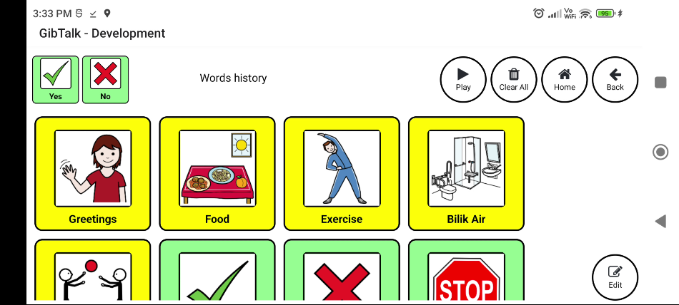

# GibTalk

Multi-language AAC app to enable communication without speaking.

[](https://apps.apple.com/us/app/gibtalk/id6504814985)
[](https://play.google.com/store/apps/details?id=com.ragibkl.GibTalk)

## Overview

GibTalk is a free, multi-language Augmentative and Alternative Communication (AAC) app that empowers people with speech disabilities to communicate clearly and confidently.

Whether you're nonverbal, have difficulty speaking due to autism, stroke, cerebral palsy, or other conditions — GibTalk helps you express yourself.

Completely free. No ads. Open source.



## Features

- **Multi-Language Support** — Use words in different languages, configurable per word
- **Customizable Word Library** — Add and edit words with custom images
- **Organize with Folders** — Group words into folders for easy navigation
- **Copy & Paste** — Move words between folders
- **Backup & Restore** — Back up and restore your wordset
- **Quick Start Templates** — Import words from pre-made templates in English and Malay
- **Symbol Search** — Search for symbols and images to use with your words
- **Text-to-Speech Keyboard** — Type and speak using the built-in keyboard

## Download

- **iOS**: [App Store](https://apps.apple.com/us/app/gibtalk/id6504814985)
- **Android**: [Google Play](https://play.google.com/store/apps/details?id=com.ragibkl.GibTalk)

## Development

GibTalk is built with [React Native](https://reactnative.dev/) and [Expo](https://expo.dev/).

### Prerequisites

- [Node.js](https://nodejs.org/)
- [Expo CLI](https://docs.expo.dev/get-started/installation/)

### Getting Started

```bash
# Install dependencies
npm install

# Start the development server
npm start

# Run on Android
npm run android

# Run on iOS
npm run ios
```

## FAQ

**How do I use a different language for a word?**
You can configure a different language for each word. Simply edit the word and choose a different language from the language dropdown. If this doesn't work, you might need to manually install text-to-speech language voice data on your device.

## Contributing

Contributions are welcome! Please open an issue or submit a pull request on [GitHub](https://github.com/ragibkl/GibTalk).

## Privacy

See [PRIVACY.md](PRIVACY.md) for our privacy policy.

## License

MIT License — see [LICENSE](LICENSE) for details.

Copyright (c) 2024 Ragib Badaruddin
